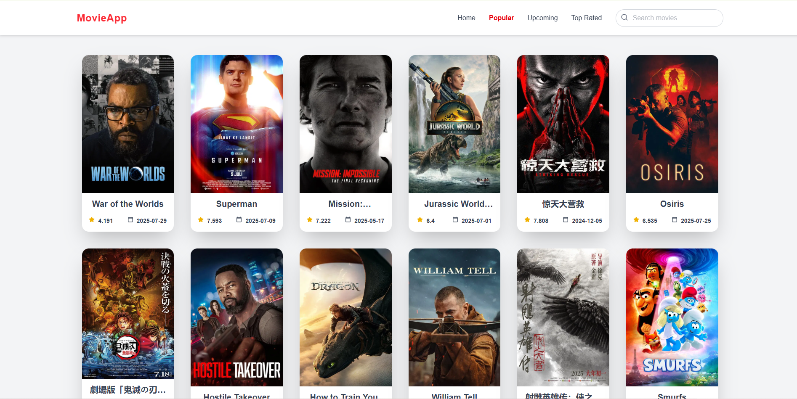

# Movie App

Aplikasi ini dirancang untuk memudahkan pengguna dalam menemukan dan menelusuri informasi film melalui integrasi dengan TMDb (The Movie Database) API, Proyek ini dibuat sebagai bagian dari portfolio dan pembelajaran dalam mengimplementasikan React + Next.js, Tailwind CSS, serta API integration secara modern dan efisien.

--

## Fitur
- Cari film favorit kamu berdasarkan judul secara cepat dan akurat menggunakan data real-time dari TMDb API.
- Telusuri berbagai kategori menarik seperti Popular, Top Rated, Now Playing, dan Upcoming Movies.
- Tampilkan informasi mendalam setiap film, termasuk poster, sinopsis, rating, tanggal rilis, dan genre.
- Lihat skor dan tingkat popularitas film berdasarkan ulasan pengguna dari seluruh dunia.
- Setiap film dilengkapi dengan gambar dan poster resmi berkualitas tinggi dari TMDb.
- Dapatkan daftar film yang baru dirilis atau akan segera tayang dengan pembaruan data otomatis.

--

## Screenshots App

### Home page


<table align="center">
  <tr>
    <td align="center" width="50%">
      <strong>Popular Page</strong><br><br>
      
    </td>
    <td align="center" width="50%">
      <strong>Top Rated Page</strong><br><br>
      
    </td>
  </tr>
  <tr>
    <td align="center" width="50%">
      <strong>Serch Movie</strong><br><br>
      
    </td>
    <td align="center" width="50%">
      <strong>Upcoming Page</strong><br><br>
      
    </td>
  </tr>
  
</table>


## Sumber Data

Aplikasi ini terhubung langsung dengan The Movie Database (TMDb) untuk mendapatkan berbagai informasi seperti:

- Judul dan sinopsis film

- Poster dan backdrop

- Rating, popularitas, serta tanggal rilis

- Genre dan detail terkait lainnya


## Tujuan Pengembangan

- Media pembelajaran dalam memahami ekosistem Next.js (App Router).

- Contoh implementasi integrasi API eksternal (TMDb).


## Getting Started

Jalankan development server:

```bash
npm run dev
# atau
yarn dev
# atau
pnpm dev
# atau
bun dev
