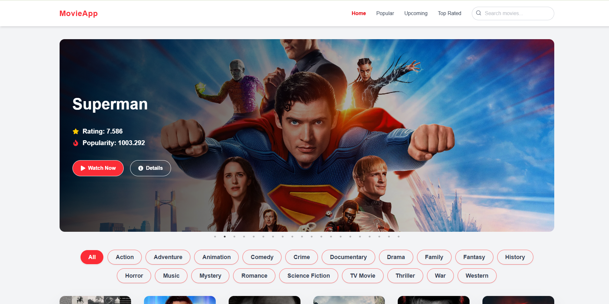
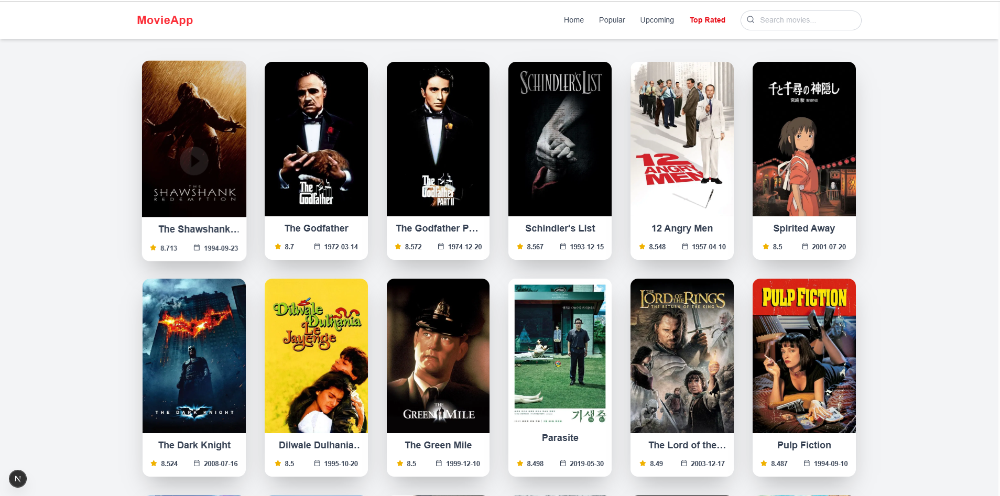
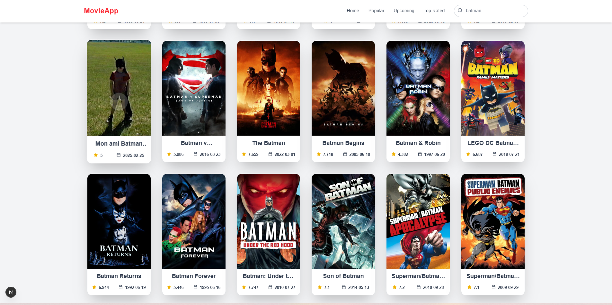
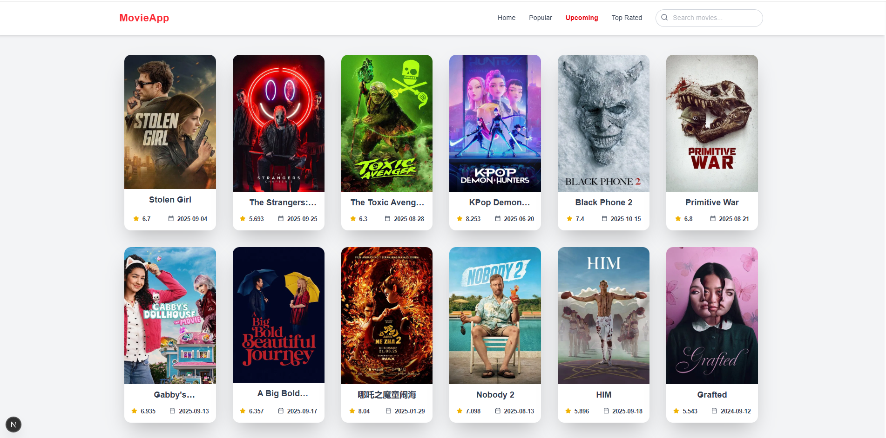

# Movie App

Aplikasi ini dirancang untuk memudahkan pengguna dalam menemukan dan menelusuri informasi film melalui integrasi dengan TMDb (The Movie Database) API, Proyek ini dibuat sebagai bagian dari portfolio dan pembelajaran dalam mengimplementasikan React + Next.js, Tailwind CSS, serta API integration secara modern dan efisien.

---

## Fitur
- Pengguna dapat mencari film berdasarkan judul secara real-time melalui TMDb API.
- Menyediakan berbagai kategori film seperti Popular, Top Rated, dan Now Playing untuk memudahkan eksplorasi.
- Dibangun menggunakan Tailwind CSS dan/atau CSS Modules, memastikan tampilan yang bersih, fleksibel, dan optimal di berbagai perangkat.
- Optimasi font dengan [`next/font`](https://nextjs.org/docs/app/building-your-application/optimizing/fonts) → [Geist](https://vercel.com/font)
- iap untuk **Deploy ke Vercel**

---

## Screenshots A

### Landing Page



<table align="center">
  <tr>
    <td align="center" width="50%">
      <strong>Home</strong><br><br>
      
    </td>
    <td align="center" width="50%">
      <strong>Page Popular</strong><br><br>
      
    </td>
  </tr>
  <tr>
    <td align="center" width="50%">
      <strong>Serch Movie</strong><br><br>
      
    </td>
    <td align="center" width="50%">
      <strong>Page Upcoming</strong><br><br>
      
    </td>
  </tr>
  
</table>


---

## Sumber Data

Aplikasi ini terhubung langsung dengan The Movie Database (TMDb) untuk mendapatkan berbagai informasi seperti:

- Judul dan sinopsis film

- Poster dan backdrop

- Rating, popularitas, serta tanggal rilis

- Genre dan detail terkait lainnya


## Tujuan Pengembangan

- Media pembelajaran dalam memahami ekosistem Next.js (App Router).

- Contoh implementasi integrasi API eksternal (TMDb).


## Getting Started

Jalankan development server:

```bash
npm run dev
# atau
yarn dev
# atau
pnpm dev
# atau
bun dev
